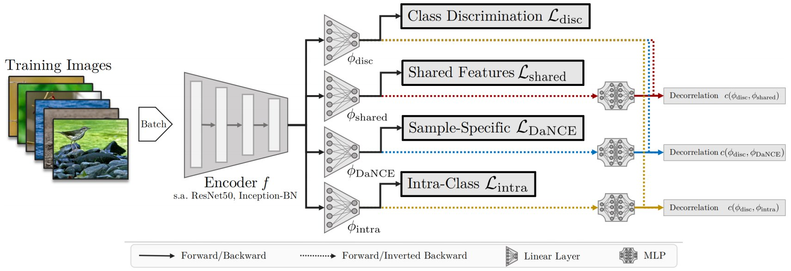

# DiVA: Including auxiliary and self-supervised features in Deep Metric Learning

---
## What can I find here?

This repository contains implementations for

```
DiVA: Diverse Visual Feature Aggregation for Deep Metric Learning
```

accepted to **ECCV 2020**.

**Link**: https://arxiv.org/abs/2004.13458

The majority of this codebase is built upon research and implementations provided in
Paper: https://arxiv.org/abs/2002.08473
Repo: https://github.com/Confusezius/Revisiting_Deep_Metric_Learning_PyTorch

This repository contains the DiVA extension to standard Deep Metric Learning by extending auxiliary and self-supervised features for improved generalization to unseen test classes:

**Contact**: Karsten Roth, karsten.rh1@gmail.com  

*Suggestions are always welcome!*

Architecturally, running DiVA extends DML like this:



---
## Some Notes:

If you use this code in your research, please cite
```
@misc{milbich2020diva,
    title={DiVA: Diverse Visual Feature Aggregation for Deep Metric Learning},
    author={Timo Milbich and Karsten Roth and Homanga Bharadhwaj and Samarth Sinha and Yoshua Bengio and Björn Ommer and Joseph Paul Cohen},
    year={2020},
    eprint={2004.13458},
    archivePrefix={arXiv},
    primaryClass={cs.CV}
}
```

---
## Requirements & Datasets:

* PyTorch 1.2.0+ & Faiss-Gpu
* Python 3.6+
* pretrainedmodels, torchvision 0.3.0+

for a detailed installation script and download links to all benchmarks, please visit
https://github.com/Confusezius/Revisiting_Deep_Metric_Learning_PyTorch


---
## Training:
Training is done by using `diva_main.py`, with settings available in `parameters.py`. Exemplary runs are provided in `SampleRuns/ECCV2020_DiVA_SampleRuns.sh`.
Logging via `Weights and Biases` follows the same setup as in https://github.com/Confusezius/Revisiting_Deep_Metric_Learning_PyTorch.

Generally, a run can look like this:

```
python diva_main.py --dataset cub200 --log_online --project DiVA_SampleRuns --group CUB_DiVA-R50-512
                    --diva_ssl fast_moco --source_path $datapath --tau 55 --gamma 0.2
                    --diva_alpha_ssl 0.3 --diva_alpha_shared 0.3 --diva_alpha_intra 0.3
                    --diva_rho_decorrelation 1500 1500 1500 --diva_features discriminative selfsimilarity shared intra
                    --diva_sharing random --evaltypes all --diva_moco_temperature 0.01  --diva_moco_n_key_batches 30
                    --n_epochs 350 --seed 0 --gpu 0 --samples_per_class 2
                    --loss margin --batch_mining distance --arch resnet50_frozen_normalize
                    --embed_dim 128
```

We apply DiVA on CUB (`--dataset cub200`) and Margin Loss (`--loss margin`) with distance-based batchmining (`--batch_mining distance`).

We use the standard `discriminative` features, as well as self-supervised features `selfsimilarity` based on "fast Momentum Contrast" (`--diva_ssl fast_moco`), corresponding to the `DaNCE` objective in the original paper, as well as `shared` and intra_class features (`intra`), all of which we note in `--diva_features discriminative selfsimilarity shared intra`.

Each auxiliary loss is weighted by `0.3` (see `--diva_alpha_ssl, --diva_alpha_shared, --diva_alpha_intra`). Each decorrelation (discriminative to ...) is weighted by `1500` (see `--diva_rho_decorrelation`). Finally, some self-supervision/MoCo specific hyperparameters (`--diva_moco_temperature, --diva_moco_n_key_batches`), corresponding to the temperature and number of key batches used in the NCE objective.

Finally, each embedding space has dimensionality `--embed_dim 128`, meaning that during testing, we evaluate on a ResNet50 with a total dimensionality of `4 x 128 = 512`.

We also note that other self-supervision methods can be included as well (see `criteria/__init__.py` and `parameters.py`), e.g. Deep Clustering:

```
python diva_main.py --source_path $datapath --log_online --project DiVA_Experiments --diva_rho_decorrelation 500
                    --diva_features discriminative dc --evaltypes all --diva_dc_update_f 2 --diva_dc_ncluster 300
                    --n_epochs 200 --seed 0 --gpu $gpu --bs 104 --samples_per_class 2 --loss margin
                    --batch_mining distance --arch bninception_normalize --embed_dim 256
```
